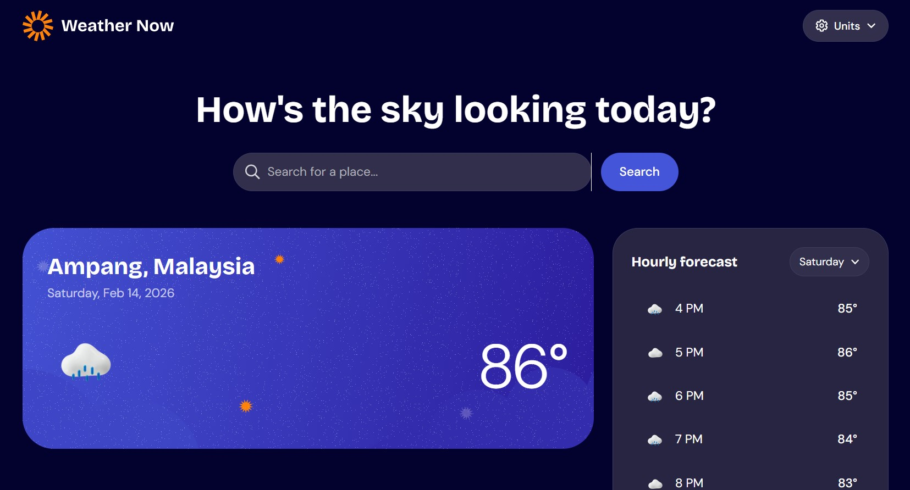

# Frontend Mentor - Weather app solution

This is a solution to the [Weather app challenge on Frontend Mentor](https://www.frontendmentor.io/challenges/weather-app-K1FhddVm49). Frontend Mentor challenges help you improve your coding skills by building realistic projects.

## 📑 Table of contents

- [📋 Overview](#overview)
  - [🎯 The challenge](#the-challenge)
  - [📸 Screenshot](#screenshot)
  - [🔗 Links](#links)
- [🚀 Getting Started](#getting-started)
  - [✅ Prerequisites](#prerequisites)
  - [📥 Installation](#installation)
  - [⚙️ Environment Variables](#environment-variables)
  - [▶️ Running the Application](#running-the-application)
- [💭 My process](#my-process)
  - [🛠️ Built with](#built-with)
  - [📁 Project Structure](#project-structure)
  - [⚡ Key Features Implementation](#key-features-implementation)
  - [💡 What I learned](#what-i-learned)
  - [🚧 Continued development](#continued-development)
  - [📖 Useful resources](#useful-resources)
- [👤 Author](#author)
- [🙏 🙏 Acknowledgments](#acknowledgments)

## 📋 Overview

### 🎯 The challenge

Users should be able to:

- Search for weather information by entering a location in the search bar
- View current weather conditions including temperature, weather icon, and location details
- See additional weather metrics like "feels like" temperature, humidity percentage, wind speed, and precipitation amounts
- Browse a 7-day weather forecast with daily high/low temperatures and weather icons
- View an hourly forecast showing temperature changes throughout the day
- Switch between different days of the week using the day selector in the hourly forecast section
- Toggle between Imperial and Metric measurement units via the units dropdown
- Switch between specific temperature units (Celsius and Fahrenheit) and measurement units for wind speed (km/h and mph) and precipitation (millimeters) via the units dropdown
- View the optimal layout for the interface depending on their device's screen size
- See hover and focus states for all interactive elements on the page

### 📸 Screenshot



### 🔗 Links

- Solution URL: [Add solution URL here](https://your-solution-url.com)
- Live Site URL: [Add live site URL here](https://your-live-site-url.com)

## 🚀 Getting Started

### ✅ Prerequisites

- Node.js (v18 or higher recommended)
- npm or yarn package manager

### 📥 Installation

1. Clone the repository:

```bash
git clone https://github.com/KC900201/front_end_mentor_weather_app.git
cd front_end_mentor_weather_app
```

2. Install dependencies:

```bash
npm install
```

### ⚙️ Environment Variables

This application uses the [Open-Meteo API](https://open-meteo.com/) for weather data, which is free and doesn't require an API key.

Create a `.env` file in the root directory (or use the API URLs directly):

```env
VITE_WEATHER_API_BASE_URL=https://api.open-meteo.com/v1/forecast
VITE_GEOCODING_API_BASE_URL=https://geocoding-api.open-meteo.com/v1
```

### ▶️ Running the Application

Development mode:

```bash
npm run dev
```

Build for production:

```bash
npm run build
```

Preview production build:

```bash
npm run preview
```

Lint code:

```bash
npm run lint
```

## 💭 My process

### 🛠️ Built with

- **React 19** - Latest React with modern features
- **TypeScript** - Type-safe JavaScript superset
- **Vite** - Next-generation frontend build tool
- **TailwindCSS v4** - Utility-first CSS framework with custom configuration
- **TanStack Query (React Query)** - Powerful data fetching and caching
- **Zustand** - Lightweight state management with persistence
- **React Router v7** - Client-side routing
- **Axios** - HTTP client for API requests
- **Lucide React** - Beautiful icon library
- **date-fns** - Modern date utility library
- **Framer Motion** - Animation library
- **Sonner** - Toast notifications
- **Open-Meteo API** - Free weather and geocoding data
- CSS custom properties and CSS Grid
- Mobile-first responsive design

### 📁 Project Structure

```
src/
├── components/
│   ├── atoms/          # Basic building blocks (Logo, WeatherIcon, Skeleton)
│   ├── molecules/      # Composite components (SearchBar, MetricsGrid, LoadingState)
│   ├── organisms/      # Complex components (Header, CurrentWeatherCard, Forecasts)
│   └── pages/          # Page-level components (HomePage, NotFound)
├── hooks/              # Custom React hooks (useWeather)
├── lib/                # Utility functions and API integration
│   ├── weatherApi.ts   # Open-Meteo API integration
│   ├── unitConversion.ts  # Temperature/wind/precipitation conversions
│   └── utils.ts        # Helper utilities
├── store/              # Zustand state management
│   └── weatherStore.ts # Global weather settings and location state
└── assets/             # Fonts, images, and static files
```

### ⚡ Key Features Implementation

**🗂️ State Management with Zustand:**

- Persistent storage for user preferences (temperature unit, wind speed unit, precipitation unit)
- Global location and selected day state
- Imperial/Metric system toggle
- Settings persist across browser sessions using localStorage

**🔄 Data Fetching with TanStack Query:**

- Efficient weather data fetching with automatic caching (3-minute stale time)
- Location search with geocoding API (5-minute stale time)
- Automatic retries on failure (3 attempts)
- Loading and error states management

**🧩 Component Architecture:**

- Atomic Design methodology (atoms → molecules → organisms → pages)
- Lazy loading for optimal performance
- Reusable components with TypeScript interfaces
- Separation of concerns with custom hooks

**🌤️ Weather API Integration:**

- Open-Meteo API for real-time weather data
- Geocoding API for location search
- Comprehensive weather code mapping (clear, cloudy, rain, snow, thunderstorm, etc.)
- Hourly and 7-day forecast data
- Current weather conditions with multiple metrics

**📱 Responsive Design:**

- Custom breakpoints (375px, 768px, 1024px, 1440px)
- Mobile-first approach
- Tailwind CSS v4 with custom theme configuration
- CSS custom properties for consistent styling
- Variable fonts for optimal loading

### 💡 What I learned

Through this project, I gained hands-on experience with several modern web development practices:

**1. State Management with Zustand Persistence:**

```typescript
export const useWeatherStore = create<WeatherState>()(
  persist(
    (set, get) => ({
      temperatureUnit: "celsius",
      windSpeedUnit: "kmh",
      precipitationUnit: "mm",
      switchToImperial: () =>
        set({
          temperatureUnit: "fahrenheit",
          windSpeedUnit: "mph",
          precipitationUnit: "inch",
        }),
      // ... more state actions
    }),
    { name: "weather-settings" }
  )
)
```

**2. TanStack Query for Efficient Data Fetching:**

```typescript
export function useWeatherQuery(
  latitude: number | null,
  longitude: number | null
) {
  return useQuery({
    queryKey: ["weather", latitude, longitude],
    queryFn: () => fetchWeather(latitude, longitude),
    enabled: latitude !== null && longitude !== null,
    staleTime: 3 * 60 * 1000, // Smart caching
    retry: 3,
  })
}
```

**3. Tailwind CSS v4 with Custom Theme:**

```css
@theme {
  --breakpoint-sm: 375px;
  --breakpoint-md: 768px;
  --font-sans: "DM Sans", -apple-system, BlinkMacSystemFont, sans-serif;
  --font-display: "Bricolage Grotesque", "DM Sans", sans-serif;
}
```

**4. TypeScript Type Safety for API Responses:**

```typescript
export interface WeatherApiResponse {
  current: {
    temperature_2m: number
    apparent_temperature: number
    relative_humidity_2m: number
    weather_code: number
  }
  hourly: {
    time: string[]
    temperature_2m: number[]
  }
  daily: {
    time: string[]
    temperature_2m_max: number[]
    temperature_2m_min: number[]
  }
}
```

Key learnings:

- Implementing persistent state management with Zustand middleware
- Optimizing data fetching with query caching and stale-time strategies
- Building type-safe API integrations with TypeScript
- Creating a scalable component architecture using Atomic Design
- Managing multiple unit systems (Imperial/Metric) with conversion utilities

### 🚧 Continued development

Areas for future enhancement and learning:

- **Testing**: Implement comprehensive unit and integration tests with Vitest and React Testing Library
- **Accessibility**: Enhance ARIA labels and keyboard navigation for better screen reader support
- **Performance**: Implement virtual scrolling for hourly forecast data
- **Features**:
  - Add weather alerts and warnings
  - Implement location detection using browser geolocation API
  - Add favorite locations management
  - Include weather radar maps
  - Add air quality index (AQI) data
- **Progressive Web App**: Convert to PWA with offline support and push notifications
- **Internationalization**: Add multi-language support using i18next
- **Dark/Light Mode**: Implement theme toggle with system preference detection
- **Animations**: Enhance UI transitions with Framer Motion

### 📖 Useful resources

- [Open-Meteo API Documentation](https://open-meteo.com/en/docs) - Excellent free weather API with comprehensive documentation
- [TanStack Query Documentation](https://tanstack.com/query/latest) - Essential for understanding data fetching, caching, and synchronization
- [Zustand Documentation](https://docs.pmnd.rs/zustand/getting-started/introduction) - Lightweight and intuitive state management
- [Tailwind CSS v4 Documentation](https://tailwindcss.com/docs) - Latest Tailwind features and configuration
- [date-fns Documentation](https://date-fns.org/) - Modern alternative to Moment.js for date manipulation
- [Atomic Design Methodology](https://atomicdesign.bradfrost.com/) - Component architecture pattern used in this project
- [React TypeScript Cheatsheet](https://react-typescript-cheatsheet.netlify.app/) - Helpful TypeScript patterns for React

## 👤 Author

- Website - [KC NG](https://kcng.netlify.app)
- Frontend Mentor - [@KC900201](https://www.frontendmentor.io/profile/KC900201)
- Instagram - [kclovinit](https://www.instagram.com/kclovinit/)

## 🙏 Acknowledgments

- [Open-Meteo](https://open-meteo.com/) for providing a free, high-quality weather API
- [Frontend Mentor](https://www.frontendmentor.io/) for the design challenge
- The React and TypeScript communities for excellent documentation and resources
- [Shadcn UI](https://ui.shadcn.com/) for component inspiration and patterns
